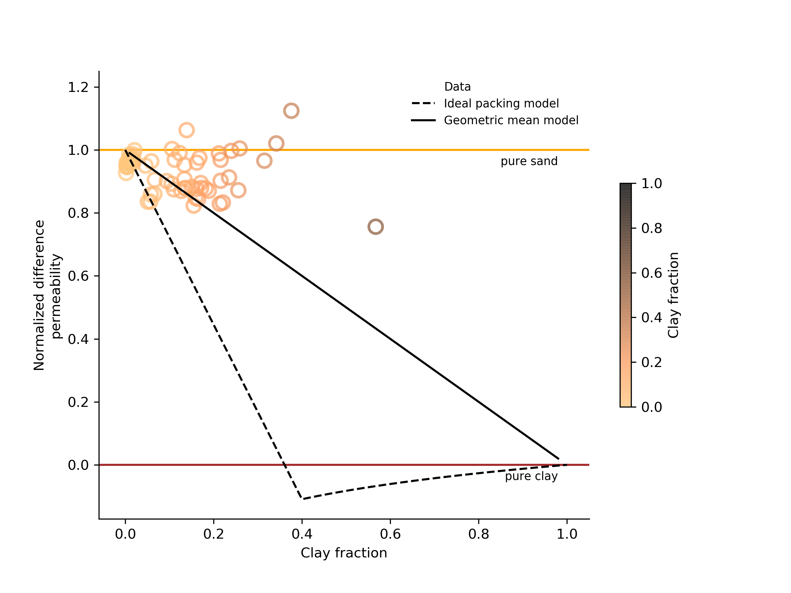

# Permeability notebooks

Jupyter notebooks to calculate the permeability of mixed siliciclastic sediments, following equations published by [Luijendijk and Gleeson (2015)](https://onlinelibrary.wiley.com/doi/full/10.1111/gfl.12115).

## Example datasets

There are two example datasets included:
1. a dataset containing porosity & permeability data from a Eocene deltaic sand unit in the Roer Valley Graben in the southern Netherlands: [data/porperm_data_well_AST02.csv](data/porperm_data_well_AST02.csv). See [Luijendijk and Gleeson (2015)](https://onlinelibrary.wiley.com/doi/full/10.1111/gfl.12115) for more information on this dataset. 
2. A small test dataset with data from marine sediments in the Nankai through: [data/example_dataset_seafloor_sediments.csv](example_dataset_seafloor_sediments.csv)

## Calculating permeability

The calculation of permeability follows two steps:

1. Calculate the specific surface of the granular (sand, silt) fraction:

	1. If your dataset includes data on grain size distribution, you can use the Jupyter notebook [estimate_specific_surface.ipynb](estimate_specific_surface.ipynb). For an example of how to name columns and organize grain size data see the example dataset [data/porperm_data_well_AST02.csv](data/porperm_data_well_AST02.csv).
	2. If your dataset does not include detailed grain size distribution statistics, but includes statistics on the mean and standard deviation of the grain size or the log-transformed grain size: Use the Jupyter notebook [estimate_specific_surface_from_gs_stats.ipynb](estimate_specific_surface_from_gs_stats.ipynb). For an example of how to name columns and organize grain size data see the example dataset [data/example_dataset_seafloor_sediments.csv](example_dataset_seafloor_sediments.csv). In both cases the notebook saves a new copy of the input dataset with added columns for the calculated specific surface of the granular fraction. The file is saved in the subdirectory [data](data), see for example [data/porperm_data_well_AST02_with_spec_surf.csv](data/porperm_data_well_AST02_with_spec_surf.csv).
	
2. Calculate the permeability of the clay fraction, granular (sand, silt) fraction and the combined permeability of the mixed sediment using the Jupyter notebook [calculate_permeability_sediment_mixtures.ipynb](calculate_permeability_sediment_mixtures.ipynb). The calculated permeability is again added to the input .csv file and saved as a new file in the subdirectory [data](data), see for example [data/porperm_data_well_AST02_with_spec_surf_with_calculated_k.csv](data/porperm_data_well_AST02_with_spec_surf_with_calculated_k.csv).

## Figures

The Jupyter notebook generate figures of the grain size distribution, specific surface, measured vs calculated permeability, and normalized permeability, which is a measure of how close the permeability of a particular sample is to the theoretical permeability of its sand or clay components. The figures are saved to the subdirectory [figs](figs), see for example the figure below, which is a partial reproduction of Fig. 5 in Luijendijk & Gleeson (2015): 

## Reference

Please cite the following paper if you publish anything that uses these notebook or datasets:

Luijendijk, E., Gleeson, T., 2015. How well can we predict permeability in sedimentary basins? Deriving and evaluating porosity-permeability equations for noncemented sand and clay mixtures. Geofluids 15, 67–83. doi:10.1111/gfl.12115

you can find the paper here: https://onlinelibrary.wiley.com/doi/full/10.1111/gfl.12115

## License
This project is licensed under the GNU lesser general public license (LGPL v3). See the [LICENSE.txt](LICENSE.txt) file for details.
